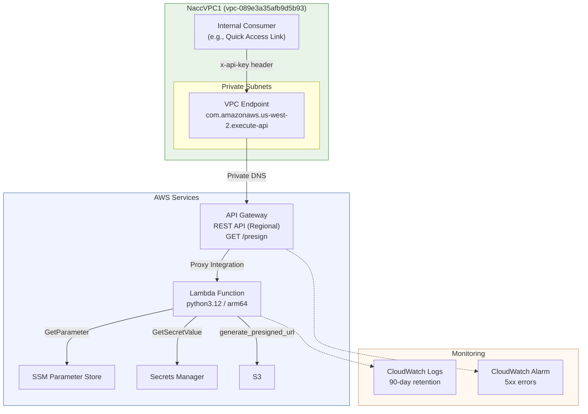

# Design Document: S3 Pre-Sign API — CDK Infrastructure

## Overview

This design covers the AWS CDK stack that provisions the API Gateway, Lambda function resource, VPC endpoint, IAM roles, CloudWatch monitoring, and all supporting infrastructure for the S3 Pre-Signed URL Service. The Lambda function code is implemented separately (see `s3-presign-lambda` spec); this stack wires it up with the correct runtime configuration, permissions, and network access controls.

### Key Design Decisions

| Decision | Choice | Rationale |
| --- | --- | --- |
| CDK Language | Python | Matches Lambda runtime; team familiarity |
| API Type | REST API (regional) | Supports resource policies, API keys, request validators natively |
| Access Restriction | VPC endpoint + resource policy | All consumers are internal to NACC VPC; no IP allowlist needed |
| Lambda VPC Attachment | None | Lambda only calls public AWS endpoints (S3, SSM, Secrets Manager); VPC endpoint is for API Gateway access only |
| API Authentication | API keys + usage plans | Simple, sufficient for internal clients; Cognito can be added later |
| Testing | `aws_cdk.assertions` | CDK-native template assertions; deterministic, no property-based testing needed for IaC |
| Build Artifacts | Pants `dist/` output | Lambda zip and layer zips produced by Pants, referenced via `Code.from_asset()` |

## Architecture



### Resource Summary

The CDK stack creates these resources:

| Resource | CDK Construct | Purpose |
| --- | --- | --- |
| REST API | `apigateway.RestApi` | Regional API with `/presign` GET endpoint |
| Request Validator | `apigateway.RequestValidator` | Validates required `bucket` and `key` query params |
| API Key | `apigateway.ApiKey` | Initial client authentication |
| Usage Plan | `apigateway.UsagePlan` | Rate limits, quota, stage association |
| Lambda Function | `lambda_.Function` | Pre-sign handler (python3.12, arm64) |
| Powertools Layer | `lambda_.LayerVersion` | aws-lambda-powertools layer |
| Deps Layer | `lambda_.LayerVersion` | Python dependencies layer |
| Execution Role | `iam.Role` | Least-privilege role for Lambda |
| VPC Endpoint | `ec2.InterfaceVpcEndpoint` | Private API Gateway access from VPC |
| Resource Policy | `iam.PolicyDocument` | Restricts API to VPC endpoint |
| Log Group | `logs.LogGroup` | Lambda logs with 90-day retention |
| CloudWatch Alarm | `cloudwatch.Alarm` | 5xx error monitoring |

## Components and Interfaces

### infra/app.py — CDK App Entry Point

```python
"""CDK application entry point for the S3 Pre-Sign Service."""

import aws_cdk as cdk

from stacks.presign_stack import PresignStack

app = cdk.App()
environment = app.node.try_get_context("environment") or "dev"

PresignStack(
    app,
    f"PresignStack-{environment}",
    environment=environment,
    env=cdk.Environment(account="090173369068", region="us-west-2"),
)

app.synth()
```

### infra/stacks/presign_stack.py — Stack Definition

```python
class PresignStack(cdk.Stack):
    """CDK stack for the S3 Pre-Signed URL Service."""

    def __init__(
        self,
        scope: Construct,
        construct_id: str,
        *,
        environment: str,
        **kwargs,
    ) -> None:
        """Initialize the stack.

        Args:
            scope: CDK app scope.
            construct_id: Stack ID.
            environment: Deployment environment ('dev' or 'prod').
        """
```

The stack constructor orchestrates resource creation in this order:

1. Import existing VPC by ID
2. Create VPC endpoint for `execute-api` in private subnets
3. Create Lambda execution role with least-privilege policies
4. Create Lambda layers (powertools + deps) from Pants artifacts
5. Create Lambda function with layers, role, and environment variables
6. Create CloudWatch log group with 90-day retention
7. Create REST API with resource policy restricting to VPC endpoint
8. Configure `/presign` resource with GET method, request validator, and API key requirement
9. Enable CORS on the `/presign` resource
10. Create API key and usage plan
11. Create CloudWatch alarm on 5xx errors
12. Export stack outputs (API URL, API key ID)

### Key Construct Details

#### VPC Import and Endpoint

```python
vpc = ec2.Vpc.from_lookup(self, "NaccVPC", vpc_id="vpc-089e3a35afb9d5b93")

vpce = ec2.InterfaceVpcEndpoint(
    self, "ApiGatewayEndpoint",
    vpc=vpc,
    service=ec2.InterfaceVpcEndpointAwsService.APIGATEWAY,
    subnets=ec2.SubnetSelection(
        subnets=[
            ec2.Subnet.from_subnet_id(self, "Private1", "subnet-0ad9370ddecc74240"),
            ec2.Subnet.from_subnet_id(self, "Private2", "subnet-0ddaf0ed4e60d11cd"),
        ]
    ),
    private_dns_enabled=True,
)
```

#### Resource Policy

```python
resource_policy = iam.PolicyDocument(
    statements=[
        iam.PolicyStatement(
            effect=iam.Effect.ALLOW,
            principals=[iam.AnyPrincipal()],
            actions=["execute-api:Invoke"],
            resources=["execute-api:/*"],
            conditions={
                "StringEquals": {
                    "aws:sourceVpce": vpce.vpc_endpoint_id,
                }
            },
        ),
        iam.PolicyStatement(
            effect=iam.Effect.DENY,
            principals=[iam.AnyPrincipal()],
            actions=["execute-api:Invoke"],
            resources=["execute-api:/*"],
            conditions={
                "StringNotEquals": {
                    "aws:sourceVpce": vpce.vpc_endpoint_id,
                }
            },
        ),
    ]
)
```

#### Lambda Function

```python
handler = lambda_.Function(
    self, "PresignHandler",
    function_name=f"{environment}-presign-handler",
    runtime=lambda_.Runtime.PYTHON_3_12,
    architecture=lambda_.Architecture.ARM_64,
    handler="s3_signed_url_lambda.lambda_function.lambda_handler",
    code=lambda_.Code.from_asset("../dist/lambda/s3_signed_url/..."),
    memory_size=512,
    timeout=cdk.Duration.seconds(30),
    tracing=lambda_.Tracing.ACTIVE,
    layers=[powertools_layer, deps_layer],
    role=execution_role,
    environment={
        "CLIENT_REGISTRY_PREFIX": f"/presign/{environment}/clients",
        "SIGNING_CREDENTIALS_SECRET": f"presign/{environment}/signing-credentials",
        "DEFAULT_EXPIRATION": "604800",
        "ENVIRONMENT": environment,
    },
)
```

#### REST API with CORS

```python
api = apigateway.RestApi(
    self, "PresignApi",
    rest_api_name=f"{environment}-presign-api",
    endpoint_configuration=apigateway.EndpointConfiguration(
        types=[apigateway.EndpointType.REGIONAL],
    ),
    policy=resource_policy,
    deploy_options=apigateway.StageOptions(stage_name=environment),
    default_cors_preflight_options=apigateway.CorsOptions(
        allow_origins=apigateway.Cors.ALL_ORIGINS,
        allow_methods=["GET", "OPTIONS"],
        allow_headers=["Content-Type", "x-api-key"],
    ),
)
```

#### Request Validator and GET Method

```python
validator = apigateway.RequestValidator(
    self, "QueryParamValidator",
    rest_api=api,
    validate_request_parameters=True,
)

presign_resource = api.root.add_resource("presign")
presign_resource.add_method(
    "GET",
    apigateway.LambdaIntegration(handler, proxy=True),
    api_key_required=True,
    request_parameters={
        "method.request.querystring.bucket": True,
        "method.request.querystring.key": True,
        "method.request.querystring.expiration": False,
    },
    request_validator=validator,
)
```

### infra/cdk.json

```json
{
  "app": "python3 app.py",
  "context": {
    "@aws-cdk/aws-apigateway:usagePlanKeyOrderInsensitiveId": true,
    "@aws-cdk/core:stackRelativeExports": true
  }
}
```

### infra/requirements.txt

```text
aws-cdk-lib>=2.150.0
constructs>=10.0.0
```

## Data Models

### Stack Parameters

The stack accepts a single context parameter:

| Parameter | Type | Default | Description |
| --- | --- | --- | --- |
| `environment` | `str` | `"dev"` | Deployment stage (`dev` or `prod`). Used to prefix resource names and parameterize SSM paths. |

### Lambda Environment Variables (set by CDK)

| Variable | Value Pattern | Description |
| --- | --- | --- |
| `CLIENT_REGISTRY_PREFIX` | `/presign/{env}/clients` | SSM prefix for client configs |
| `SIGNING_CREDENTIALS_SECRET` | `presign/{env}/signing-credentials` | Secrets Manager secret name |
| `DEFAULT_EXPIRATION` | `604800` | Default URL expiration (seconds) |
| `ENVIRONMENT` | `dev` or `prod` | Deployment stage |

### IAM Execution Role Permissions

| Permission | Resource Scope | Rationale |
| --- | --- | --- |
| `ssm:GetParameter` | `arn:aws:ssm:us-west-2:090173369068:parameter/presign/{env}/clients/*` | Client registry lookup |
| `ssm:GetParametersByPath` | Same as above | Batch client lookup |
| `secretsmanager:GetSecretValue` | `arn:aws:secretsmanager:us-west-2:090173369068:secret:presign/{env}/signing-credentials*` | Signing credential retrieval |
| `logs:CreateLogGroup` | Lambda log group ARN | Log group creation |
| `logs:CreateLogStream` | Lambda log group ARN | Log stream creation |
| `logs:PutLogEvents` | Lambda log group ARN | Log writing |
| `xray:PutTraceSegments` | `*` | X-Ray tracing |
| `xray:PutTelemetryRecords` | `*` | X-Ray telemetry |

The role explicitly does NOT include `s3:GetObject` — signing uses dedicated IAM user credentials from Secrets Manager.

### Resource Policy Structure

The API Gateway resource policy uses two statements:
1. ALLOW `execute-api:Invoke` on `execute-api:/*` when `aws:sourceVpce` equals the VPC endpoint ID
2. DENY `execute-api:Invoke` on `execute-api:/*` when `aws:sourceVpce` does not equal the VPC endpoint ID

### Stack Outputs

| Output | Export Name Pattern | Value |
| --- | --- | --- |
| API Endpoint URL | `{env}-presign-api-url` | `api.url` (includes stage) |
| API Key ID | `{env}-presign-api-key-id` | `api_key.key_id` |

### VPC Endpoint Configuration

| Property | Value |
| --- | --- |
| Service | `com.amazonaws.us-west-2.execute-api` |
| VPC | `vpc-089e3a35afb9d5b93` (NaccVPC1) |
| Subnets | `subnet-0ad9370ddecc74240` (NaccPrivate1), `subnet-0ddaf0ed4e60d11cd` (NaccPrivate2) |
| Private DNS | Enabled |

### CloudWatch Alarm Configuration

| Property | Value |
| --- | --- |
| Metric | `5XXError` on the API Gateway |
| Statistic | `Sum` |
| Period | 5 minutes |
| Threshold | Configurable (e.g., 5 errors) |
| Evaluation Periods | 1 |


## Correctness Properties

*A property is a characteristic or behavior that should hold true across all valid executions of a system — essentially, a formal statement about what the system should do. Properties serve as the bridge between human-readable specifications and machine-verifiable correctness guarantees.*

Since this is a CDK infrastructure spec, correctness is validated by synthesizing the CloudFormation template and asserting on its structure. Most acceptance criteria map to deterministic structural assertions (examples) rather than universally quantified properties. Two properties emerge from the prework analysis:

### Property 1: Environment parameterization

*For any* valid environment string (e.g., `"dev"`, `"prod"`, `"staging"`), synthesizing the stack with that environment value should produce a template where:
- The Lambda function's `ENVIRONMENT` environment variable equals the provided value
- The API Gateway stage name equals the provided value
- Stack output export names contain the provided value
- Resource names are prefixed or parameterized with the provided value

This is a universal property: the stack must correctly propagate any environment value through all parameterized resources.

**Validates: Requirements 1.2, 1.4, 2.6, 7.4, 11.3**

### Property 2: No S3 data-plane permissions on execution role

*For any* IAM policy statement attached to the Lambda execution role, the statement's actions must not include `s3:GetObject`, `s3:PutObject`, or any other `s3:*` data-plane action. The execution role is exclusively for SSM, Secrets Manager, CloudWatch Logs, and X-Ray access.

**Validates: Requirements 8.6**

## Error Handling

Error handling in the CDK stack is primarily about deployment-time validation and fail-safe defaults. Runtime error handling is covered by the Lambda spec.

### CDK Synthesis Errors

| Condition | Behavior |
| --- | --- |
| Missing `environment` context | Defaults to `"dev"` — no error |
| Invalid Pants artifact path | CDK `Code.from_asset()` raises at synth time if path doesn't exist |
| VPC lookup failure | `Vpc.from_lookup()` fails at synth time if VPC ID is invalid or account context is missing |
| Subnet ID mismatch | `Subnet.from_subnet_id()` does not validate at synth time; deployment fails if subnet doesn't exist |

### Deployment Errors

| Condition | Behavior |
| --- | --- |
| VPC endpoint already exists for service | CloudFormation deployment fails; must import or remove existing endpoint |
| API key name collision | CloudFormation handles uniqueness via logical IDs |
| IAM policy too permissive | Not an error, but a security concern caught by review |
| Lambda code asset missing | Deployment fails with clear CloudFormation error |

### Mitigation

- The stack uses `try_get_context("environment") or "dev"` to provide a safe default
- VPC and subnet IDs are hardcoded to known-good values from the verified AWS environment
- The resource policy uses explicit DENY + ALLOW to ensure no accidental open access
- Log retention is set explicitly to avoid unbounded log storage

## Testing Strategy

### Test Framework

- `pytest` — test runner
- `aws_cdk.assertions` — CDK template assertion library for validating synthesized CloudFormation templates
- No property-based testing library (hypothesis) — CDK infrastructure tests are deterministic assertions against a synthesized template, not randomized input testing

### Test Approach

CDK tests synthesize the stack and assert on the resulting CloudFormation template. This is deterministic — the same CDK code always produces the same template. Tests use two assertion styles:

1. **Fine-grained assertions** (`template.has_resource_properties`): Verify specific resource configurations
2. **Resource count assertions** (`template.resource_count_is`): Verify expected number of resources

### Test File Organization

```text
infra/tests/
    __init__.py
    conftest.py              # Shared fixtures: synthesized template for dev/prod
    test_presign_stack.py    # All stack assertions
```

### Test Fixtures (conftest.py)

- `dev_template` fixture: Synthesizes the stack with `environment="dev"` and returns a `Template` object
- `prod_template` fixture: Synthesizes the stack with `environment="prod"` for environment parameterization tests
- Both fixtures use `assertions.Template.from_stack()` on the synthesized stack

### Test Cases

| Test | Requirement | Assertion Type |
| --- | --- | --- |
| REST API exists with regional endpoint | 2.1, 2.2 | has_resource_properties |
| GET method on /presign with proxy integration | 2.1, 2.5 | has_resource_properties |
| Request validator validates query params | 13.1 | has_resource_properties |
| Required params: bucket (true), key (true), expiration (false) | 2.3, 2.4, 13.2, 13.3 | has_resource_properties |
| CORS: allow origins *, headers, methods | 3.1, 3.2, 3.3 | has_resource_properties |
| API key required on GET method | 4.1 | has_resource_properties |
| API key resource exists | 4.2 | resource_count_is |
| Usage plan with rate limits and quota | 4.3, 4.4 | has_resource_properties |
| VPC endpoint for execute-api | 5.1 | has_resource_properties |
| VPC endpoint in private subnets | 5.2 | has_resource_properties |
| VPC endpoint private DNS enabled | 5.3 | has_resource_properties |
| Resource policy allows from VPC endpoint | 5.4 | has_resource_properties |
| Resource policy denies non-VPC-endpoint | 5.5 | has_resource_properties |
| Lambda runtime python3.12 | 6.1 | has_resource_properties |
| Lambda architecture arm64 | 6.2 | has_resource_properties |
| Lambda memory 512 MB | 6.3 | has_resource_properties |
| Lambda timeout 30s | 6.4 | has_resource_properties |
| Lambda X-Ray active tracing | 6.5 | has_resource_properties |
| Lambda has 2 layers | 6.7 | has_resource_properties |
| Lambda env vars: all 4 present | 7.1, 7.2, 7.3, 7.4 | has_resource_properties |
| Dedicated IAM role exists | 8.1 | resource_count_is |
| Role has SSM read permissions | 8.2 | has_resource_properties |
| Role has Secrets Manager read | 8.3 | has_resource_properties |
| Role has CloudWatch Logs write | 8.4 | has_resource_properties |
| Role has X-Ray write | 8.5 | has_resource_properties |
| Role has NO s3:* permissions (Property 2) | 8.6 | custom assertion |
| Log group with 90-day retention | 9.1, 9.2 | has_resource_properties |
| CloudWatch alarm on 5XXError metric | 10.1 | has_resource_properties |
| Alarm period 300s, Sum statistic | 10.2, 10.3 | has_resource_properties |
| Stack output: API URL | 11.1 | has_output |
| Stack output: API key ID | 11.2 | has_output |
| Environment parameterization (Property 1) | 1.2, 2.6, 7.4, 11.3 | compare dev vs prod templates |

### Property 1 Test Implementation

The environment parameterization property is tested by synthesizing the stack twice (with `"dev"` and `"prod"`) and asserting that environment-dependent values change accordingly:

```python
def test_environment_parameterization(dev_template, prod_template):
    """Property 1: For any environment value, the stack parameterizes resources correctly."""
    # Verify Lambda ENVIRONMENT env var differs
    dev_template.has_resource_properties("AWS::Lambda::Function", {
        "Environment": {"Variables": {"ENVIRONMENT": "dev"}}
    })
    prod_template.has_resource_properties("AWS::Lambda::Function", {
        "Environment": {"Variables": {"ENVIRONMENT": "prod"}}
    })
    # Verify stage names differ, output export names differ, etc.
```

### Property 2 Test Implementation

The no-S3-permissions property is tested by inspecting all IAM policy statements in the synthesized template:

```python
def test_no_s3_permissions_on_execution_role(dev_template):
    """Property 2: Execution role must not grant any s3:* actions."""
    # Extract all IAM policy resources and verify no Action contains s3:*
```

### Running Tests

Tests are run via Pants from the repo root:

```bash
# Via kiro-pants-power
pants_test with scope="directory", path="infra/tests"

# Via manual scripts
./bin/exec-in-devcontainer.sh pants test infra/tests::
```

### What Is NOT Tested

- Runtime behavior of API Gateway (request routing, CORS headers in responses) — tested via integration tests, not CDK assertions
- Lambda function code correctness — covered by `s3-presign-lambda` spec
- VPC endpoint network connectivity — verified during deployment and integration testing
- Actual API key values — generated by CloudFormation at deploy time
