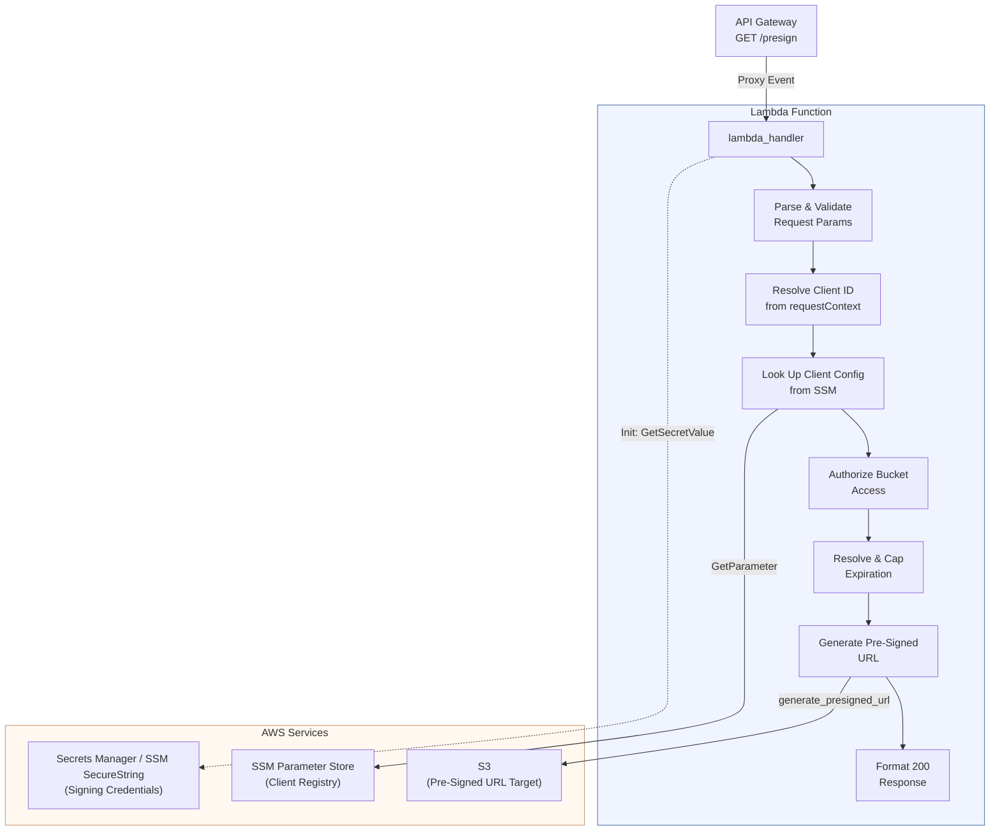
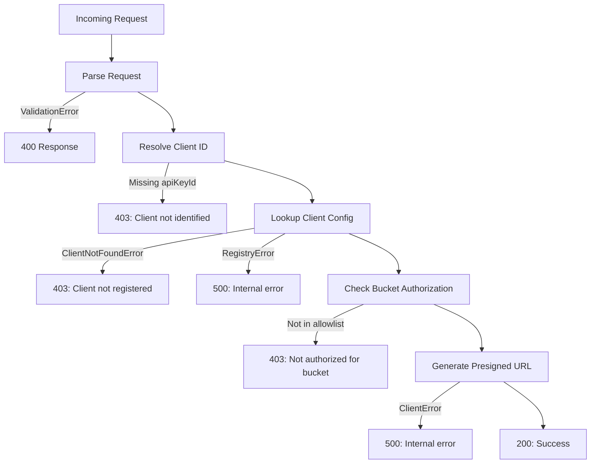

# Design Document: S3 Pre-Signed URL Lambda

## Overview

This design covers the Lambda function that generates time-limited pre-signed S3 GET URLs for authorized app clients. The Lambda receives requests via API Gateway, validates the caller against a client registry stored in SSM Parameter Store, enforces per-client bucket allowlists and expiration limits, and returns a signed URL.

The signing uses long-term IAM user credentials (retrieved from Secrets Manager or SSM SecureString) rather than the Lambda execution role, enabling URL expirations up to the S3 hard maximum of 7 days (604,800 seconds).

### Key Design Decisions

| Decision | Choice | Rationale |
| --- | --- | --- |
| Client Registry | SSM Parameter Store | Simple, sufficient for a small number of clients, no table provisioning needed |
| Signing Credentials | IAM user creds in Secret Store | Enables up to 7-day presigned URL expiration (S3 hard limit for IAM user signatures) |
| Data Validation | Pydantic v2+ | Type-safe, consistent validation, clear error messages |
| Logging | aws-lambda-powertools Logger | Structured JSON logs with request ID correlation |
| Testing | moto + pytest | Realistic AWS service mocking without live calls |
| Build System | Pants | Monorepo-native, handles Lambda packaging and layers |

## Architecture



### Request Flow

1. API Gateway forwards the proxy event to `lambda_handler`
2. Handler extracts `bucket`, `key`, and optional `expiration` from `queryStringParameters`
3. Handler extracts `client_id` from `requestContext.identity.apiKeyId`
4. Client config is fetched from SSM Parameter Store at `{CLIENT_REGISTRY_PREFIX}/{client_id}`
5. Requested bucket is checked against the client's `allowed_buckets`
6. Expiration is resolved: requested → default → capped to client's `max_expiration` → capped to 604,800
7. A dedicated S3 client (using cached IAM user credentials) generates the pre-signed URL
8. Handler returns `{"url": "...", "expires_in": <seconds>}` with status 200

### Module Responsibilities

| Module | Responsibility |
| --- | --- |
| `lambda_function.py` | Handler entry point, event parsing, response formatting, error handling, credential init |
| `client_registry.py` | SSM Parameter Store lookup, client config parsing and caching |
| `models.py` | Pydantic models for request, client config, and response |

## Components and Interfaces

### lambda_function.py — Handler Entry Point

```python
# Module-level initialization (runs once per cold start)
_signing_credentials: dict | None = None  # Cached IAM user creds
_s3_signing_client: boto3.client | None = None  # S3 client using IAM user creds

def _init_signing_client() -> boto3.client:
    """Retrieve signing credentials from Secret Store and create S3 client.
    Called once per cold start, cached for warm invocations."""

def lambda_handler(event: dict[str, Any], context: LambdaContext) -> dict[str, Any]:
    """Entry point. Parse event → validate → authorize → sign → respond."""

def _parse_request(event: dict[str, Any]) -> PresignRequest:
    """Extract and validate query string parameters and client identity."""

def _resolve_expiration(requested: int | None, client_max: int) -> int:
    """Apply default, cap to client max, cap to system max (604800)."""

def _build_response(status_code: int, body: dict) -> dict[str, Any]:
    """Format API Gateway proxy response with JSON body and headers."""

def _error_response(status_code: int, message: str) -> dict[str, Any]:
    """Format error response."""
```

### client_registry.py — Client Registry

```python
class ClientRegistry:
    """Looks up client configurations from SSM Parameter Store."""

    def __init__(self, ssm_client: Any, prefix: str):
        """Initialize with an SSM client and the parameter prefix path."""

    def get_client_config(self, client_id: str) -> ClientConfig:
        """Fetch and parse client config from SSM.
        Raises ClientNotFoundError if parameter doesn't exist.
        Raises RegistryError if SSM is unreachable."""
```

### models.py — Pydantic Models

```python
class PresignRequest(BaseModel):
    """Parsed and validated request parameters."""
    bucket: str
    key: str
    expiration: int | None = None
    client_id: str

class ClientConfig(BaseModel):
    """Client configuration from the registry."""
    client_id: str
    allowed_buckets: list[str]
    max_expiration: int
    description: str

class PresignResponse(BaseModel):
    """Successful response payload."""
    url: str
    expires_in: int
```

### Dependency Injection Strategy

- `ClientRegistry` accepts an `ssm_client` parameter — tests pass a moto-mocked client
- The signing S3 client is created at module level using credentials from the Secret Store
- For testing, the module-level signing client can be replaced or the `generate_presigned_url` call can be tested via moto's S3 mock
- The `lambda_handler` uses module-level clients; tests reset module state between runs

### Error Types

```python
class ClientNotFoundError(Exception):
    """Raised when client_id is not found in the registry."""

class RegistryError(Exception):
    """Raised when SSM Parameter Store is unreachable or returns an error."""

class ValidationError(Exception):
    """Raised when request parameters fail validation."""
```

## Data Models

### SSM Parameter Store — Client Registry

Each client is stored as a JSON string at the path `{CLIENT_REGISTRY_PREFIX}/{client_id}`:

```json
{
    "client_id": "quickaccess-web",
    "allowed_buckets": ["naccquickaccess"],
    "max_expiration": 604800,
    "description": "NACC Quick Access Link web app"
}
```

- Prefix path configured via `CLIENT_REGISTRY_PREFIX` env var (e.g., `/presign/clients`)
- Full parameter path: `/presign/clients/quickaccess-web`
- Parameter type: `String` (JSON-encoded)

### Secrets Manager — Signing Credentials

The signing credentials secret contains:

```json
{
    "access_key_id": "AKIA...",
    "secret_access_key": "..."
}
```

- Secret ARN or SSM path configured via `SIGNING_CREDENTIALS_SECRET` env var
- Retrieved once at Lambda cold start, cached for warm invocations

### Environment Variables

| Variable | Required | Default | Description |
| --- | --- | --- | --- |
| `CLIENT_REGISTRY_PREFIX` | Yes | — | SSM prefix path for client configs |
| `SIGNING_CREDENTIALS_SECRET` | Yes | — | Secret Store ARN/path for IAM user creds |
| `DEFAULT_EXPIRATION` | No | `604800` | Default URL expiration in seconds |
| `ENVIRONMENT` | No | — | Deployment stage (dev/prod) |

### API Gateway Proxy Event (Input)

The handler expects an API Gateway REST API proxy integration event. Relevant fields:

```json
{
    "queryStringParameters": {
        "bucket": "my-bucket",
        "key": "path/to/object.csv",
        "expiration": "3600"
    },
    "requestContext": {
        "identity": {
            "apiKeyId": "abc123keyid"
        }
    }
}
```

### Response Format

Success (200):
```json
{
    "statusCode": 200,
    "headers": {"Content-Type": "application/json"},
    "body": "{\"url\": \"https://...\", \"expires_in\": 3600}"
}
```

Error (400/403/500):
```json
{
    "statusCode": 400,
    "headers": {"Content-Type": "application/json"},
    "body": "{\"error\": \"Missing required parameter: bucket\"}"
}
```

## Correctness Properties

*A property is a characteristic or behavior that should hold true across all valid executions of a system — essentially, a formal statement about what the system should do. Properties serve as the bridge between human-readable specifications and machine-verifiable correctness guarantees.*

### Property 1: Valid request produces a presigned URL response

*For any* valid request with a non-empty bucket name that appears in the client's `allowed_buckets`, a non-empty object key, and a registered client ID, the handler shall return a 200 response with a JSON body containing a non-empty `url` string and an `expires_in` integer matching the resolved expiration.

**Validates: Requirements 1.1, 7.1, 8.1**

### Property 2: Invalid expiration values are rejected

*For any* string that is not a positive integer (including negative numbers, zero, floats, and non-numeric strings), when provided as the `expiration` query parameter, the handler shall return a 400 response with an `error` field in the JSON body.

**Validates: Requirements 1.5**

### Property 3: Client config round-trip through SSM

*For any* valid `ClientConfig` (with a non-empty client_id, a non-empty allowed_buckets list, a positive max_expiration, and a non-empty description), storing it as a JSON parameter in SSM at `{prefix}/{client_id}` and then retrieving it via `ClientRegistry.get_client_config(client_id)` shall produce an equivalent `ClientConfig`.

**Validates: Requirements 3.1**

### Property 4: Bucket authorization matches allowlist membership

*For any* client config and any bucket name, the authorization check shall permit the request if and only if the bucket name is an exact member of the client's `allowed_buckets` list.

**Validates: Requirements 4.1, 4.2, 4.3**

### Property 5: Expiration resolution is capped correctly

*For any* requested expiration (or absence thereof), any default expiration, and any client `max_expiration`, the resolved expiration shall equal `min(requested_or_default, client_max_expiration, 604800)` where `requested_or_default` is the requested value if provided, otherwise the default expiration value.

**Validates: Requirements 5.1, 5.2, 5.3, 5.4, 5.5, 1.6**

### Property 6: All responses include Content-Type application/json

*For any* request (valid or invalid), the handler response shall include a `Content-Type` header with value `application/json`.

**Validates: Requirements 8.2, 9.4**

### Property 7: Error responses contain structured error field

*For any* request that fails validation (missing/empty params, invalid expiration) or authorization (unknown client, unauthorized bucket), the handler response shall have the appropriate HTTP status code (400 or 403) and a JSON body containing a non-empty `error` string field.

**Validates: Requirements 9.1, 9.2**

### Property 8: Pydantic model serialization round-trip

*For any* valid `PresignRequest`, `ClientConfig`, or `PresignResponse` instance, serializing to dict and reconstructing from that dict shall produce an equivalent model instance.

**Validates: Requirements 12.1, 12.2, 12.3**

## Error Handling

### Error Classification

| HTTP Status | Condition | Error Message Pattern | Log Level |
| --- | --- | --- | --- |
| 400 | Missing `bucket` parameter | `Missing required parameter: bucket` | WARNING |
| 400 | Missing `key` parameter | `Missing required parameter: key` | WARNING |
| 400 | Empty `bucket` or `key` | `Invalid parameter: {param} must not be empty` | WARNING |
| 400 | Invalid `expiration` | `Invalid expiration: must be a positive integer` | WARNING |
| 403 | No client identity in request context | `Client identity could not be resolved` | WARNING |
| 403 | Client ID not found in registry | `Client not registered: {client_id}` | WARNING |
| 403 | Bucket not in client's allowlist | `Client not authorized for bucket: {bucket}` | WARNING |
| 500 | Secret Store unreachable | `Internal server error` | ERROR |
| 500 | Malformed signing credentials | `Internal server error` | ERROR |
| 500 | SSM Parameter Store unreachable | `Internal server error` | ERROR |
| 500 | boto3 client error during URL generation | `Internal server error` | ERROR |
| 500 | Any other unexpected exception | `Internal server error` | ERROR |

### Error Handling Strategy

- 400/403 errors: Return a descriptive message to the caller. Log at WARNING level with request context.
- 500 errors: Return a generic `"Internal server error"` message. Log the full exception with stack trace at ERROR level. Never expose internal details (secret names, SSM paths, stack traces) in the response body.
- All error responses use the same `_error_response()` helper to ensure consistent JSON structure and headers.

### Exception Flow



## Testing Strategy

### Test Framework and Libraries

- **pytest** — test runner and fixtures
- **moto** (`moto[s3,ssm,secretsmanager]>=5.0.0`) — AWS service mocking for S3, SSM, and Secrets Manager
- **hypothesis** — property-based testing library for Python
- **Pants** — runs tests via `pants test lambda/s3_signed_url/test/python::`

### Dual Testing Approach

Tests use both unit tests (specific examples and edge cases) and property-based tests (universal properties across generated inputs). Both are complementary:

- **Unit tests** verify specific scenarios: happy path, each error condition, edge cases
- **Property-based tests** verify universal invariants across randomly generated inputs

### Test File Organization

```
lambda/s3_signed_url/test/python/
    conftest.py                 # Shared fixtures: moto mocks, client configs, event builders
    test_lambda_function.py     # Handler integration tests (unit + property)
    test_client_registry.py     # ClientRegistry tests (unit + property)
    test_models.py              # Pydantic model tests (property)
    test_validation.py          # Request validation and expiration resolution (property)
```

### Mock Strategy (conftest.py)

- `@pytest.fixture` for moto-mocked SSM, S3, and Secrets Manager clients
- Factory functions for building API Gateway proxy events with customizable parameters
- Factory functions for registering client configs in mocked SSM
- Factory functions for storing signing credentials in mocked Secrets Manager
- Module-level signing client state is reset between tests

### Unit Test Cases

| Test | Requirement | Status Code |
| --- | --- | --- |
| Valid request returns presigned URL | 1.1, 7.1, 8.1 | 200 |
| Missing bucket parameter | 1.2 | 400 |
| Missing key parameter | 1.3 | 400 |
| Empty bucket string | 1.4 | 400 |
| Empty key string | 1.4 | 400 |
| Invalid expiration (non-integer) | 1.5 | 400 |
| Invalid expiration (zero) | 1.5 | 400 |
| Invalid expiration (negative) | 1.5 | 400 |
| No client identity in request context | 2.2 | 403 |
| Unknown client ID | 3.2 | 403 |
| SSM unreachable | 3.4 | 500 |
| Unauthorized bucket | 4.2 | 403 |
| Secret Store unreachable | 6.3 | 500 |
| Malformed signing credentials | 6.4 | 500 |
| boto3 client error during signing | 7.4 | 500 |
| Missing required env vars | 11.5 | Init failure |
| Default expiration when env var not set | 11.1 | 200 |

### Property-Based Test Cases

Each property test uses `hypothesis` with `@given` decorators and runs a minimum of 100 examples.

| Property Test | Design Property | Tag |
| --- | --- | --- |
| Valid request → 200 with url + expires_in | Property 1 | `Feature: s3-presign-lambda, Property 1: Valid request produces a presigned URL response` |
| Non-positive-integer expiration → 400 | Property 2 | `Feature: s3-presign-lambda, Property 2: Invalid expiration values are rejected` |
| Client config SSM round-trip | Property 3 | `Feature: s3-presign-lambda, Property 3: Client config round-trip through SSM` |
| Bucket in allowlist ↔ authorized | Property 4 | `Feature: s3-presign-lambda, Property 4: Bucket authorization matches allowlist membership` |
| Resolved expiration = min(req_or_default, client_max, 604800) | Property 5 | `Feature: s3-presign-lambda, Property 5: Expiration resolution is capped correctly` |
| All responses have Content-Type header | Property 6 | `Feature: s3-presign-lambda, Property 6: All responses include Content-Type application/json` |
| Error responses have status + error field | Property 7 | `Feature: s3-presign-lambda, Property 7: Error responses contain structured error field` |
| Pydantic model dict round-trip | Property 8 | `Feature: s3-presign-lambda, Property 8: Pydantic model serialization round-trip` |

### Property-Based Testing Configuration

- Library: `hypothesis` (add `hypothesis>=6.100.0` to `requirements.txt`)
- Minimum iterations: 100 per property (via `@settings(max_examples=100)`)
- Each property test is tagged with a comment referencing the design property
- Each correctness property is implemented by a single `@given`-decorated test function
- Generators produce random but valid instances of `PresignRequest`, `ClientConfig`, bucket names, expiration values, and API Gateway events
